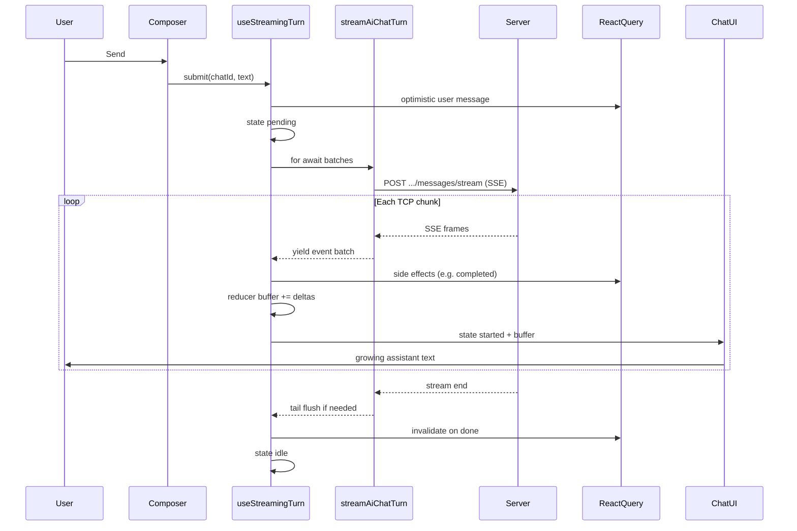
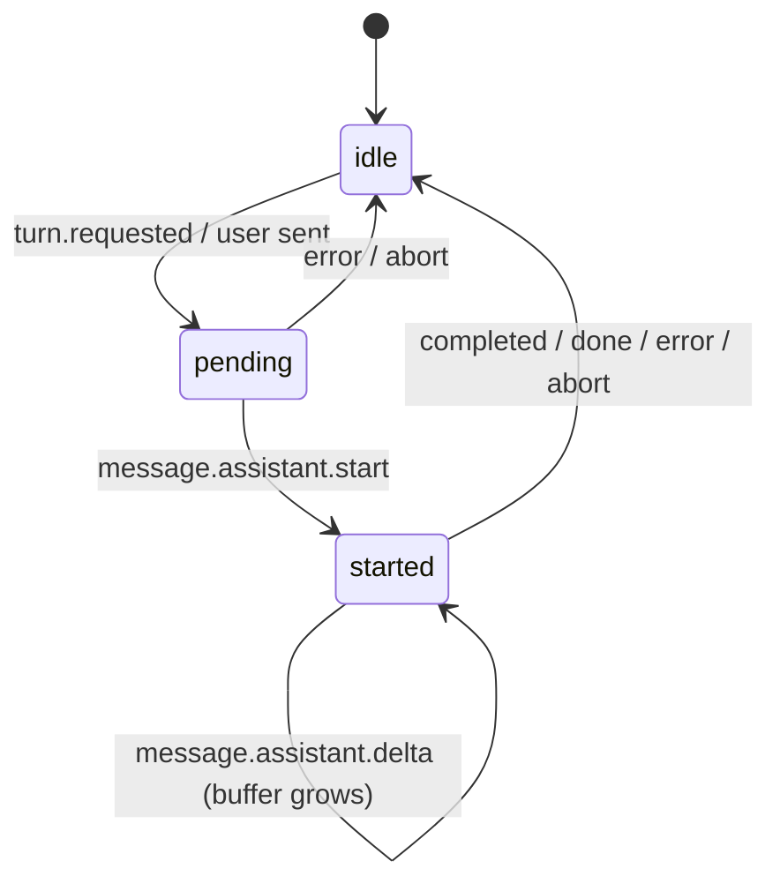

# AI Assistant - streaming (portal)

This folder contains the **live turn** path: sending a user message and showing the assistant reply while it is still being generated. Chat history, sidebar CRUD, and panel chrome live elsewhere under `AiAssistantPanel/`.

The backend contract is documented in `qubership-apihub-backend/docs/feature_design/ai_assistant/ai-chat-frontend-contract.md` and `APIHUB_API.yaml` (tag **AI Chat**). This readme explains how the portal code uses that contract, in plain language.

## What "streaming" means here

A normal HTTP response arrives all at once. Here the server keeps the connection open and sends **small JSON messages over time** using **SSE** (Server-Sent Events): text chunks framed as `event:` / `data:` lines, separated by an empty line.

The UI does **not** wait for the full answer. It reads the stream, updates local state after each network chunk, and re-renders the assistant message as text grows.

You cannot use the browser `EventSource` API for this flow (it only supports GET). The portal uses `fetch()` plus a `ReadableStream` reader instead.

## Folder layout

| Path         | Role                                                               |
| ------------ | ------------------------------------------------------------------ |
| `transport/` | HTTP + SSE parsing: bytes -> `AiChatStreamEvent[]`                 |
| `turn/`      | Turn state machine, React Query cache updates, submit/abort        |
| `markdown/`  | Live assistant Markdown (light render while streaming, full after) |

Shared API types (`AiChatStreamEvent`, messages, roles) stay in `../api/types.ts`. Event name constants are in `transport/aiChatStream.ts`.

UI wiring (message list, Thinking label, composer, jump button) stays in `../ui/chat/` and reads streaming state from `AiAssistantProvider` via context.

## End-to-end flow



## Layer 1 - Transport (`transport/`)

**Entry point:** `streamAiChatTurn` in `sse.ts` (an **async generator** - `async function*` with `yield`). That pattern is rare in this repository but fits SSE well: the consumer pulls the next batch when ready instead of loading the whole body into memory.

Rough steps:

1. `POST /api/v1/ai-chat/chats/{chatId}/messages/stream` with `{ content, clientMessageId }`.
2. Read the response body in chunks (`reader.read()`).
3. `sseFramer.ts` splits the text buffer into complete SSE frames (frames end with `\n\n`).
4. Each frame's `data:` line is JSON -> `AiChatStreamEvent`.
5. **Yield once per TCP read** with all events parsed from that chunk (not one yield per event), so the turn layer can run one reducer update per chunk.
6. **Tail flush:** when the connection closes, the last bytes may not end with `\n\n`. The code appends `\n\n` once, parses any leftover frame, yields it, then stops - otherwise the last events could be lost.

Event types the turn layer cares about most:

| Event                         | Effect on UI state                                 |
| ----------------------------- | -------------------------------------------------- |
| `message.assistant.start`     | Turn moves to "started", new assistant `messageId` |
| `message.assistant.delta`     | Append `delta` string to in-memory `buffer`        |
| `message.assistant.completed` | Final message written to React Query cache         |
| `error`                       | Toast + partial answer kept if any                 |
| `done`                        | Invalidate chat list / messages queries            |

Other events (`tool.started`, `tool.completed`, `context.compacted`, ...) are part of the backend contract but are **not** rendered yet. They still affect UX indirectly (see Thinking below).

## Layer 2 - Turn (`turn/`)

**Entry point:** `useStreamingTurn` - used from `AiAssistantProvider`, exposed on context as `streaming`.

### Turn states



| State     | What the user sees                                                   |
| --------- | -------------------------------------------------------------------- |
| `idle`    | No active generation                                                 |
| `pending` | User message shown; **Thinking** (waiting for first assistant token) |
| `started` | Live assistant bubble with text from `buffer`                        |

`streamingTurnReducer.ts` holds `buffer` and status. `processBatch` in `useStreamingTurn` applies side effects (cache writes, toasts) then dispatches `sseBatch` to the reducer.

React Query:

- **Optimistic user message** is prepended immediately on send.
- On **completed**, the final assistant row is prepended to the cache.
- On **abort** or **error** with partial text, a partial assistant message may be saved.
- On **done**, queries are invalidated so history matches the server.

### "Thinking" during tool / network gaps

While status is `started`, only `message.assistant.start` / `delta` refresh a "last text activity" timestamp. Other SSE events (tools, compaction) can leave the turn in `started` **without new text** for a while.

A **short poll** (see `STREAM_THINKING_POLL_MS` in `streamingTurnConstants.ts` and the comment in `useStreamingTurn`) shows the **Thinking** indicator if no assistant token arrived for ~1s. A single timeout per delta is not enough when non-text events arrive with no deltas in between.

### Constants

`streamingTurnConstants.ts` - turn statuses, reducer action names, error copy, thinking timings, optimistic ID prefix.

Jump-to-latest FAB phase constants live in `../ui/chat/chatScreenConstants.ts` (UI-only, not turn logic).

## Layer 3 - Live Markdown (`markdown/`)

While streaming, `ChatAssistantMessage` uses `AI_ASSISTANT_MARKDOWN_MODE.streaming`: GFM without syntax highlighting, via `CodeBlock` with header hidden.

When the turn ends, the same message renders in **full** mode (highlighting, copy button) using authoritative `content` from the cache after `completed`.

`normalizeStreamingMarkdown.ts` closes unfinished fenced code blocks during streaming so raw `` ``` `` lines do not flash on screen.

## What lives outside this folder

| Location                                    | Responsibility                                      |
| ------------------------------------------- | --------------------------------------------------- |
| `state/AiAssistantProvider.tsx`             | Creates `useStreamingTurn`, puts it on context      |
| `ui/chat/*`                                 | Message list, Thinking, composer, scroll / jump FAB |
| `ui/markdown/AiAssistantMarkdownViewer.tsx` | Shared Markdown viewer (history + stream)           |
| `api/types.ts`                              | Shared TypeScript contract types                    |

## Mental model (one paragraph)

User sends -> optimistic user row + HTTP SSE stream opens -> each network chunk becomes a **batch of events** ->
reducer appends text to `buffer` -> chat UI shows a synthetic assistant message until `completed` replaces it with
the server message -> `done` refreshes queries.

Stop aborts `fetch` and may keep partial text. The generator in `sse.ts` bridges network chunks and React; the turn
hook bridges events and UI/cache.

## Tests

- `transport/sseFramer.unit-test.ts` - SSE frame splitting
- `turn/streamingTurnReducer.unit-test.ts` - reducer folding and error peek helper
